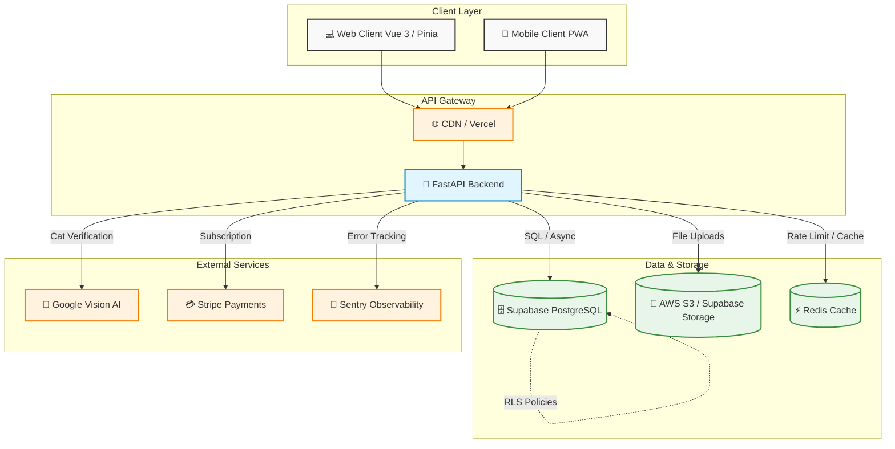

# Purrfect Spots Architecture

This document outlines the high-level architecture of the Purrfect Spots project, designed for scalability, security, and a premium user experience.

## System Architecture Diagram

## Architecture Layers

### 1. Client Layer (Frontend)
- **Framework**: Built with Vue 3 (Composition API) and Vite.
- **State Management**: managed via Pinia.
- **Styling**: Tailwind CSS v4 with a custom design system ("Ghibli Aesthetic").
- **Security**: Handles OAuth flows and stores JWTs securely contextually.

### 2. API Gateway & Logic Layer (Backend)
- **Framework**: FastAPI (Python 3) for asynchronous API endpoints.
- **Pydantic Models**: Used extensively for parsing, validation, and serialization.
- **Middleware**: Incorporates CSRF protection, rate limiting, and generic error handling.

### 3. Data & Storage Layer
- **Primary Database**: Supabase PostgreSQL. Heavily leverages Row Level Security (RLS) to enforce data access policies directly within the database engine.
- **Caching**: Redis is used for API rate limiting (via `slowapi`) and caching high-traffic views (like Leaderboards and Gallery stats).
- **Storage**: AWS S3 compatible storage for saving uploaded cat photos securely.

### 4. External Services
- **Google Cloud Vision API**: Used to process uploaded images and enforce that only valid cat photos are uploaded.
- **Stripe**: Powers the premium membership features and quota increases.
- **Sentry/Jaeger**: Integrated for observability, tracing, and logging.

## Security Posture
- **Zero Trust**: Data access is uniformly protected by RLS; the backend generally uses a service role or accesses data impersonating users via their JWT tokens.
- **Data Integrity**: Enforced through backend validation, Google Vision verification, and database triggers.
